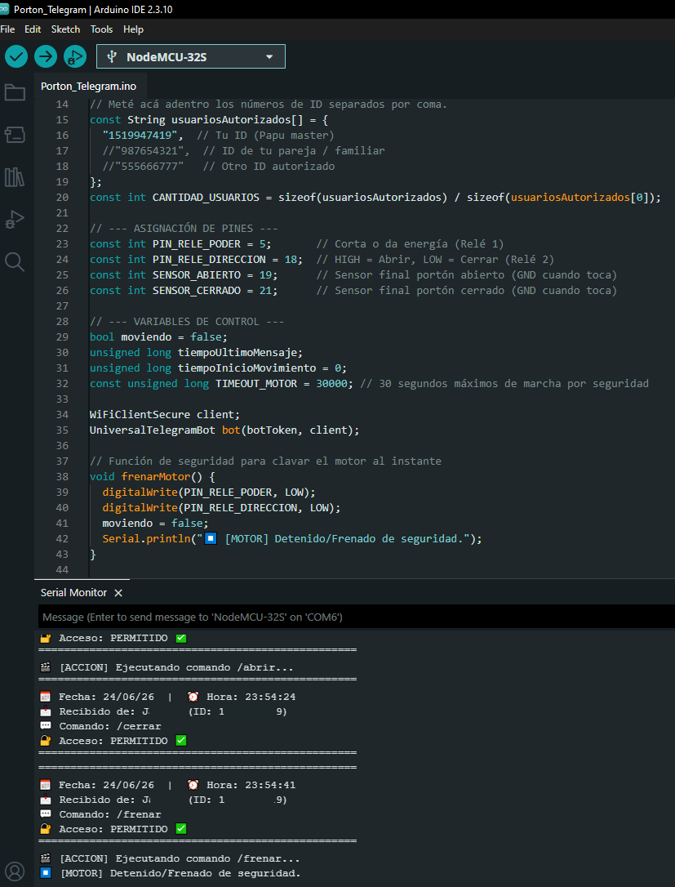

# 🚗 Control de Portón Automatizado Seguro con ESP32 y Telegram

Este proyecto permite automatizar y controlar el motor de un portón residencial utilizando un microcontrolador **ESP32** y un bot de **Telegram**. Está diseñado bajo un enfoque de **alta seguridad física y digital**, ideal para reemplazar placas de motores quemadas o añadir control inteligente multiusuario.

---

## ✨ Características Principales
* **🔒 Doble Relé Inmune a Cortocircuitos:** Configuración *Poder + Dirección*. Evita físicamente enviar corriente simultánea a los dos bobinados del motor (lo que quemaría el motor en segundos).
* **👥 Acceso Multiusuario Controlado:** Filtrado estricto por lista blanca de `Chat ID` de Telegram. Si un usuario no autorizado interactúa con el bot, el sistema lo rebota y reporta el intruso por consola.
* **🛑 Monitoreo por Finales de Carrera:** Apagado instantáneo por hardware mediante sensores magnéticos/mecánicos cuando el portón abre o cierra por completo.
* **🚨 Temporizador de Respaldo (Timeout):** Si un sensor falla o el portón se traba mecánicamente, el ESP32 corta la energía automáticamente tras 30 segundos de marcha.
* **📅 Bitácora Serial con Fecha y Hora:** Reporte detallado en el Monitor Serie con marca temporal (`DD/MM/AA HH:MM:SS`) provista directamente por los paquetes de la API de Telegram.

---

## 🔌 Diagrama de Conexiones Básicas

El circuito utiliza la resistencia `INPUT_PULLUP` interna del ESP32 para los sensores, simplificando el cableado (se activan cuando hacen puente directo a `GND`).


### Pines Utilizados:
* **GPIO 5:** Entrada de Señal del **Relé 1 (Poder)** -> Corta/Da energía general a los 220V/12V.
* **GPIO 18:** Entrada de Señal del **Relé 2 (Dirección)** -> Cambia entre la vía de Abrir (HIGH) o Cerrar (LOW).
* **GPIO 19:** Conectado al **Sensor de Portón Abierto** (Cierra a GND al activarse).
* **GPIO 21:** Conectado al **Sensor de Portón Cerrado** (Cierra a GND al activarse).
* **5V & GND:** Alimentación del módulo de relés.

---

## 🤖 Comandos Disponibles en Telegram

El bot responde de manera estricta a los siguientes comandos de texto:
* `/start` - Muestra el menú principal de asistencia.
* `/abrir` - Configura el relé de dirección en abrir e inicia la marcha del motor.
* `/cerrar` - Configura el relé de dirección en cerrar e inicia la marcha del motor.
* `/frenar` - Detiene el motor inmediatamente en cualquier posición.
* `/estado` - Consulta en tiempo real la lectura de los sensores finales de carrera.

---

## 💻 Requisitos e Instalación (Arduino IDE)

1. Instalar las siguientes librerías desde el **Gestor de Librerías** del Arduino IDE:
   * **UniversalTelegramBot** (por *Brian Lough*)
   * **ArduinoJson** (por *Benoit Blanchon*, se recomienda versión **6.x**)
2. Configurar las variables del código con tus datos:
   ```cpp
   const char* ssid = "TU_WIFI_NAME";
   const char* password = "TU_WIFI_PASSWORD";
   const char* botToken = "TU_TOKEN_DE_BOT_FATHER";
   
   const String usuariosAutorizados[] = {
     "TU_CHAT_ID_1",
     "CHAT_ID_2"
   };

   Si te encuentras fuera de Argentina (UTC-3), recuerda ajustar la constante de conversión horaria en la función de mensajes:

C++
const long DIFERENCIA_HORARIA = -3; // Ajusta según tu huso horario

📺 Vista del Monitor Serial (Logs)
El sistema imprime de forma elegante y en tiempo real el estado de las solicitudes:

Plaintext
==================================================
📅 Fecha: 24/06/26  |  ⏰ Hora: 23:24:15
📩 Recibido de: Juan Perez (ID: 123456789)
💬 Comando: /abrir
🔐 Acceso: PERMITIDO ✅
==================================================
🎬 [ACCION] Ejecutando comando /abrir...
✨ ¡Portón ABIERTO por completo! Fin de carrera alcanzado.
⏹️ [MOTOR] Detenido/Frenado de seguridad.

💡 Proyecto creado con fines educativos y de automatización del hogar. Asegurar un correcto aislamiento térmico y eléctrico al manipular voltajes de red doméstica (220V/110V).

Codifico: Gemini
Guia espiritual: Yim

Juast Coding 4 fun !!!

